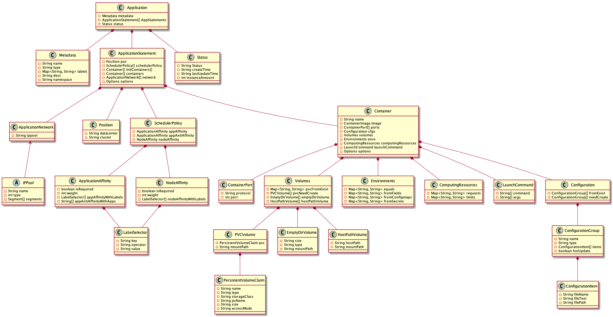
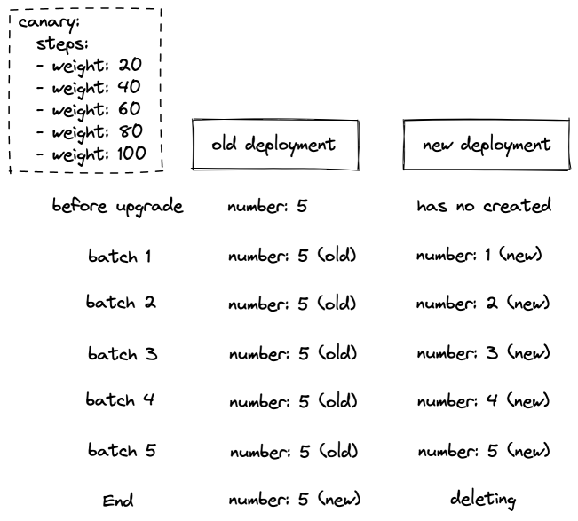
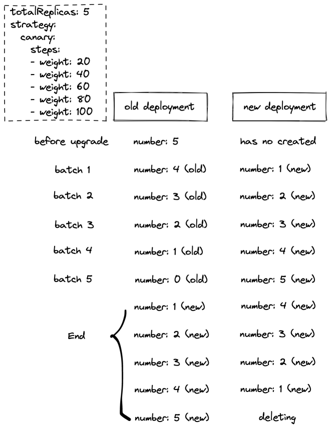

# Box设计方案

# 设计方向

## 应用方向

与应用模型oam类似，拓展性高。

## 资源封装

支持sts、ds、deploy、pod等形式的部署，对这部分资源的功能进行拓展，例如支持蓝绿升级、资源关联等；

### 设计思路

box资源实现了对sts、ds、deploy、pod等资源的封装，box控制器监听box资源的变更，对其封装的资源进行增删改。同时会开启线程根据策略定时找到其封装资源的关联资源，提取信息更新到状态中去。

    apiVersion: box/v1alpha1
    kind: Box
    metadata:
      name: box-test
      namespace: test
    spec:
      workloadType: Deployment
      resource:  <deployment data>
    status:
      relevanceResource:
        service:
          clusterIPs:
          - 10.10.101.216

1、支持sts、ds、deploy、pod等形式的部署，目前暂时先支持无状态应用Deployment；

2、支持无状态应用的蓝绿升级、金丝雀升级；

目前金丝雀升级在升级过程中，资源占用量会根据批次实例数量上升，造成资源使用浪费，在资源紧张时，可能无法完成升级过程。所以在在支持金丝雀升级的基础之上，增加滚动升级。同时会增加字段用于控制是否使用滚动升级模式。

3、支持下发资源的关联资源信息查询；

在用户开发、测试、运维的过程中，经常需要应用相关联的资源详情，例如svc、pvc、cm等。如果用户通过box下发应用之后，还能够在状态中看到其关联资源的信息，将大大提高用户效率。

    apiVersion: box/v1alpha1
    kind: RelevanceResource
    metadata:
      name: box-svc
    spec:
      rule:
        cue: """
            
          output: service: {
            clusterIPs?: [...string]
          } & {
            if context.spec.clusterIPs != _|_ {
              clusterIPs: context.spec.clusterIPs
            }
          }
            
        """
      connections:
        type: MatchLabels
        keyPath: $.spec.template.metadata.labels # jsonpath语法
      resourceRef:
        group: ""
        version: v1
        kind: Serivce
    

CUE 是一种开源数据验证语言和推理引擎，其根源在于逻辑编程。