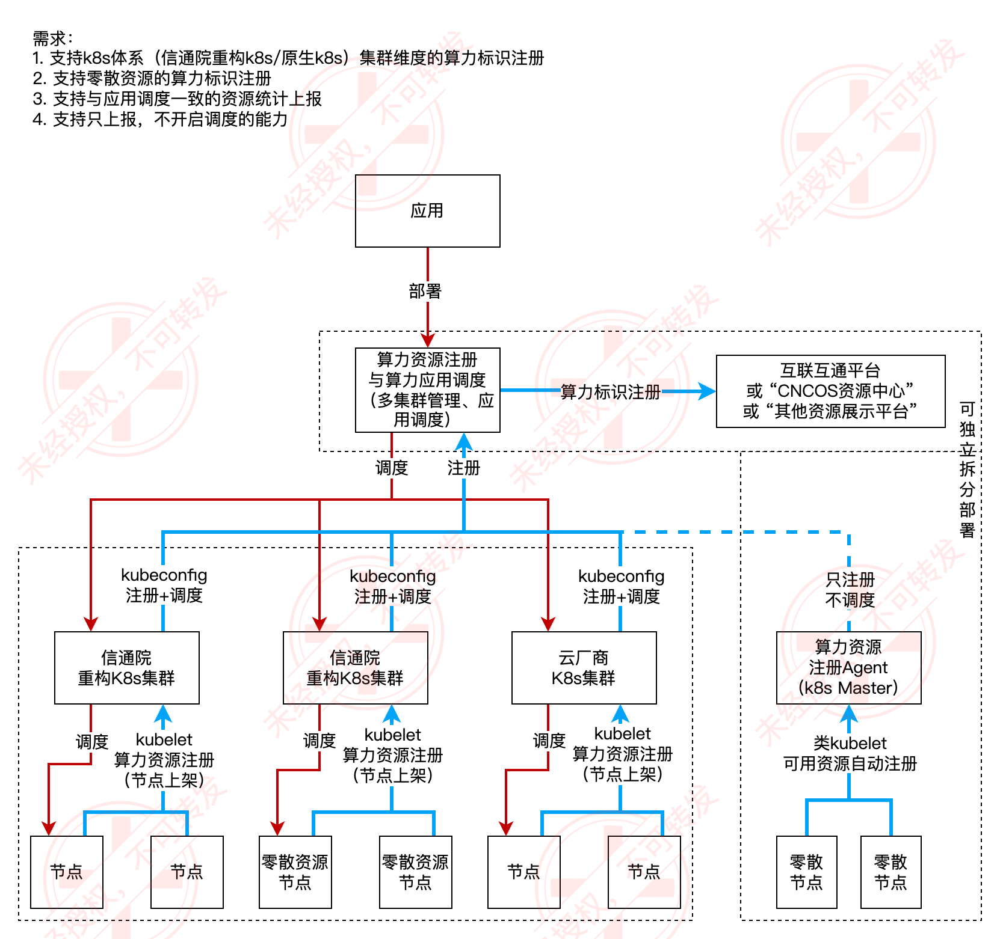

通算-容器场景，集群作为算力标识上报的最小单位，上报目标为互联互通平台。

### 架构图

### 需求汇总
#### 静态资源注册工具
> 功能要求：通过命令将资源的唯一标识信息以静态资源的方式进行注册，包括算力资源所在的城市代码、行业代码、企业类型等。
节点算力标识以 Label 形式注入；此处无需进行开发，只需在节点添加时，根据算力标识规范进行处理。

#### 动态资源扫描服务
> 功能要求： 通过探测服务将动态资源进行注册，包括计算资源、存储资源、网络带宽、算力互联网地址、芯片类型等。需注意的是，如果算力资源实时变化，这里可进行实时的更新和上报。
 
#### 算力资源上报服务
> 功能要求：注册完成后，算力资源上报服务将自动将这些信息上报至算力资源展示服务。
另外，算力资源的注册上报地址是可供配置的，默认上报至部署于本地的算力资源展示服务，可上报至远程服务，如互联互通平台。

#### 算力资源展示服务
> 功能要求：通过命令行，从算力资源展示服务中获取已上报的算力资源信息。 同时，我们也可以从算力资源展示服务中获取已上报算力资源的算力标识符信息。

### 概要设计
#### 静态资源注册工具

#### 动态资源扫描服务

#### 算力资源上报服务
该模块负责将节点算力资源进行资源总量及标识数值的统一转换，上报至互联互通平台。
1. 节点算力标识的校验：算力标识统一配置至 configmap 中，对于未合理注册的节点，将不进行算力的注册；
2. 节点算力资源的计算与汇总：算力资源归类，合并同类项；
3. 集群算力标识的转换：将 Label 信息转换至算力标识码；
4. 集群算力标识的上报：实时上报至互联互通平台；

1. 创建一个控制器，定期获取集群中所有节点的资源情况，并将结果发送到指定的注册中心（Web 服务器）；
2. 并发地运行多个控制器实例，以同时处理多个 Kubernetes 集群；
3. 多集群情况，集群 kubeconfig 的获取：定义从 kube-system 命名空间中，带有 cluster_resources_register_kubeconfig=true 标签的 ConfigMap 中动态获取多个 kubeconfig，并启动相应的控制器实例；
4. 根据节点上的标签进行归类资源可用量的统计。节点的标签算力标识标准，会通过 ConfigMap 存储，支持动态调整；
5. 给出存储在 configmap 中的 kubeconfig的示例，包括按照之前约定的标签；
6. 该 web server 通过 kubernetes  部署，要求写好对应的 manifests 或 helm chart 包；
7. 该控制器通过 kubernetes 部署，支持 manifests 或 helm chart 的部署方式；

#### 算力资源展示服务

### TODO
1. 支持多种类CPU、GPU型号的检测
2. 支持注册数据落入数据库，取代留存于内存中（当前因支持实时上报，以内存存储更合理）
3. 支持算力标识的资源表的读取，及解析的自动映射

### 部署方式
详细参考文档 [install.md](./docs/install.md)